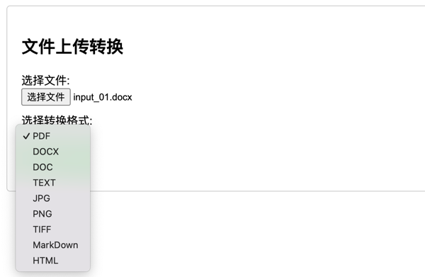

# QuickFile
文档快捷服务Java练习，支持常用文档转换。
> ⚠️Aspose.Words for Java API 目前好像还不支持PDF转换成其他文件⚠️

# 在线体验地址
http://43.138.173.93:8688/convert.html

# docker部署
1. 修改 `src/main/resources/static/convert.html` html文件的表单提交地址为你的服务器地址
2. 项目根目录执行 `mvnw clean package` 生成服务 jar 包
3. 执行 `build.sh` 生成项目 `docker` 镜像
4. 最后执行 `run.sh` 运行项目镜像